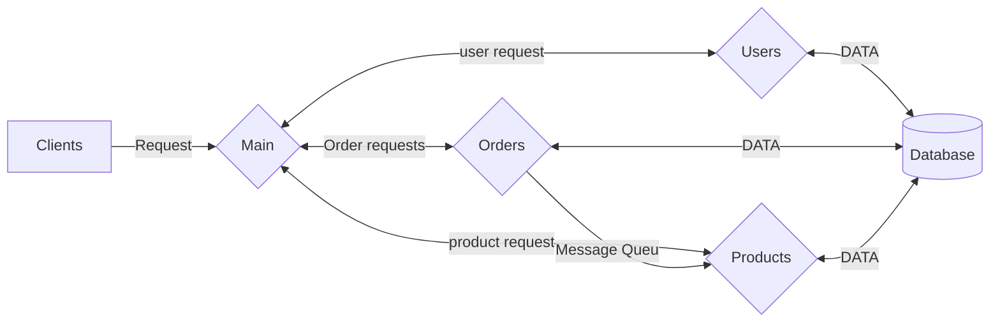
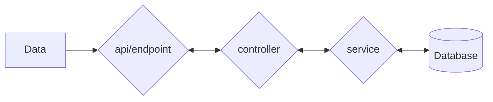
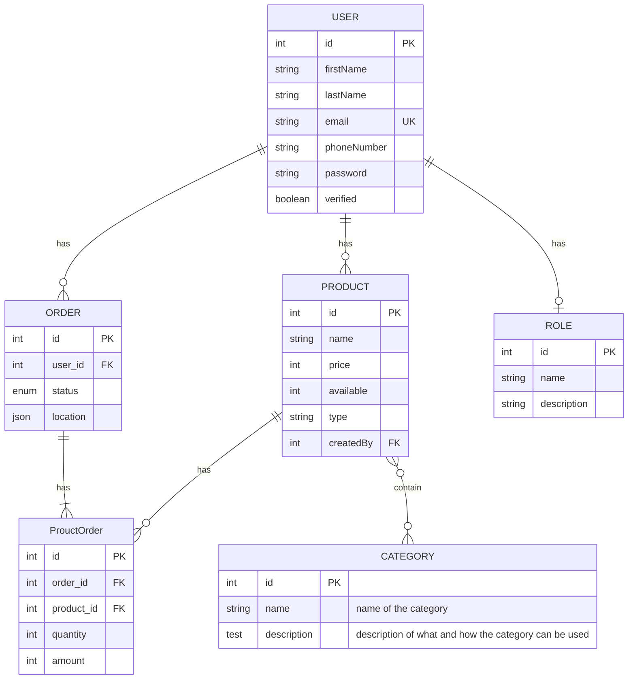
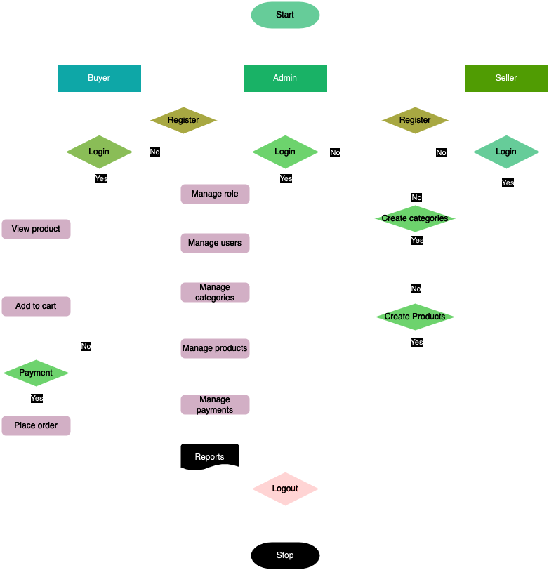

# Online market place

### Description

Welcome to Online marketplace, this guide will walk yyou through the steps to set up and run this project api on your local machine

### Prerequisites
- Nodejs
- Express
- Typescript
- TypeORM
- Postgres and
- Docker

### Technologies
- Docker
- Typescript
- Nestjs
- Postgres
- RabitMQ
- Jest
- OpenAPI

### Data flow

#### Overall design


#### Module design


### ER Diagram


### Flow chart


### Getting Started

#### Clone the repository
Clone this project repository to your local machine using Git
```bash
git clone https://github.com/Habinezajanvier/marketplace.git
```

#### Navigate to the project Directory
Change your working directory to the project folder
```bash
cd marketplace
```

#### Environment Configuration
Create `.env` file in your root directory and fill it using `.env.example` template
```bash
cp .env.example .env
```

#### Database Setup

Using your postgres CLI or postgres Client, create a database name, and replace it in your `.env`

#### Starting the server

Start the project using docker compose
```bash
docker compose -f docker-compose.dev.yml up --build
```

#### Access the appliction
You can now access the project by navigating to `http//localhost:3000` or any other port set

### Additional information
#### Api documentation
Explore the available api endpoints by navigating to `http//localhost:3000/api-docs`

#### Testing
Use jest to run tests on your local machine
```bash
yarn test
```

#### Troubleshooting
If you accounter any issue during setup or while running the application, please refer to the project documentation or [email](mailto:habinezajanvier688@gmail.com) me

### License
This project is licensed under a proprietary license. Unauthorized copying, modification, or distribution of this software is strictly prohibited.